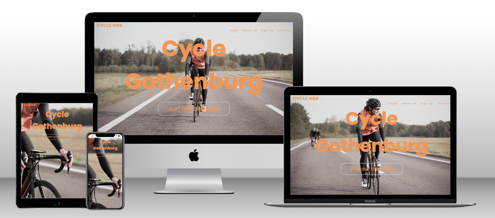

<h1 align="center">Cycle Gothenburg</h1>

Cycle Gothenburg is a website for a fictional organisation that aims to build a community for long-distance cyclists in and around Gothenburg and to encourage more to take up cycling. The target audience for the website is people who are just starting out with long-distance cycling, those who are interested in getting started and for those who have more experience but are looking for a group of people to ride with. Through the website one can simply sign up to group rides and get a time, a place and a route for the ride.

[View live website here](https://e-tidemo.github.io/cycle-gothenburg/)

## Index - Table of Contents
* 
* 
* 
* 
* 
* 
* 

- ## User Experience (UX)
  - ### 1. Goals for a First Time Visitor
    - a. For a first time visitor, it is important to get a grasp of what the website is about - easily and quickly.
    - b. For a first time visitor, it is important to be able to navigate the website easily.
    - c. For a first time visitor, it is important to easily find more information about the business.
    - d. For first time visitors, it is important to be able to contact the organisation with any questions about the concept.
    - e. For first time visitors, it is important that the sign up is easy to understand and to do.
  
  - ### 2. Goals for a Returning Visitor
    - a. For a returning visitor of the website, it is important that they can access the menu to navigate easily and quickly around the website, especially to the sign up-page.
    - b. For a returning visitor, it is important that they can contact the organisation easily with questions or feedback.

  - ### 3. Goals for a Frequent User
    - a. For a frequent visitor of the website, the most important thing is that the sign up is easy and quick.

- ## Features
  - ### Existing Features
    - **Navigation bar**
      - The navigation bar is set at the top right of the website on all pages which supports easy navigation. On smaller devices, such as mobile phones, this moves to a hamburger menu toggle bar.
      - The navigation bar is also marked for each page, for example, on the home page the navigation bar shows that you are currently on the "Home" page with a line underneath.
    - **Additional links to sign up**
      - On the Home page, the link to sign up is very prominent in the middle of the page. This link is also the main explanation of what the organisation does as it says "Join our cycling groups".
      - On the page "About us" there is also a link embedded in the text that leads to the sign up page. The purpose of adding the additional links is to encourage the website visitor to sign up with easy access to the page for signing up.
    - **Sign up page**
      - The page to sign up contains a form where the person who would like to sign up fills out their basic information, their skill level in cycling and what level ride they would like to join.
      - The form also includes a checkbox at the end where the user can choose to sign up to get an email regularly for the chosen kind of group ride. If the user just wants to join one ride they can simply not check the box.
      - The sign up page also has a map to where the group rides always start.
    - **Contact page**
      - The contact page includes a form for questions or feedback, a form to let the organisation know if you want to lead group rides, a map with the starting point of all rides and information such as email address and phone number to the organisation.
    - **Footer**
      - The footer is the same on each page, which makes it easy to use, and features the organisation's social media accounts as well as an adress of where the group rides always start.
    - ### Future Features
     - 

- ## Design
  - ### Colour scheme:
    
    A colour palette was created that reflected the video on the home page - reminiscent of the asfalt grey of roads and with a pop of colour which was inspired by the front figure's jacket.
  - ### Typography
 
  - ### Imagery
    The background-video and imagery were chosen to bring a bit of nature and calming colours of nature as this website is based around wellness and outdoor sports. The imagery was used as the foundation of the colour palette. All imagery is sourced from sites that don't infringe Copyright and I have credited these in the [credits](#Credits) section.
  - ### Wireframes
    
    
    
    
  - ### Accessibility
  For a user experience that works for everyone, I have done the following to make sure that the website is as accesible as possible:
   - Used semantic HTML
   - Used contrasting colours throughout the website.
   - Used descriptive alt attributes on images.
   - Provided information for screen readers where there are icons and no text, such as the logo.
   - Ensured that the menus are accessible by marking the current page as the current for screen readers.

- ## Technologies Used
  - ### Language Used
    The languages used for this website are HTML and CSS.

  - ### Frameworks, Libraries and Programs Used
    [Balsamiq:](https://balsamiq.com/) was used to create wireframes

    [Uxwing:](https://uxwing.com/) was used to add icons.
    
    [Pexels:](https://www.pexels.com/sv-se/) was used to find images and videos for the styling of the webpage.

    [Google Fonts:](https://fonts.google.com/) was used to import the 'Poppins' and 'Lato' fonts into the style.css file which are used on all pages of the project.

    [Git:](https://git-scm.com/) was used for version control by utilising the Gitpod terminal to commit to Git and Push to GitHub.

    [GitHub:](https://github.com/) is used as the respository for the projects code after being pushed from Git.

- ## Deployment

- ## Testing
    Testing was done throughout the project, not least with Chrome developer tools which I used to troubleshoot issues that would arise while building the website.

    - ### Validator Testing
    [HTML Validator](https://validator.w3.org/)

    All pages of the website were tested in the HTML validator with the following results:

    index.html:

    form.html:

    about.html:

    contact.html:

    [CSS Validator](https://jigsaw.w3.org/css-validator/)

    The CSS code was tested in the CSS validator with the following result:

    - ### Solved Bugs
    The dropdown navigation bar that appears on smaller devices would be too wide for the screen. This led to the text disappearing on the left and the right sides on some smaller devices.

    - ### Known Bugs
    There was one bug I didn't manage to fix and it is that the contact information appears to the left on a bigger screen even though I would have liked to have it centered.

- ## Credits
  - ### Code Used
    ["How To Add Video Background In Website Using HTML And CSS Step By Step Tutorial"](https://www.youtube.com/watch?v=znqUwx0b0HI)
    ["Mobile First Video Background with HTML & CSS" by DivByDiv](https://www.youtube.com/watch?v=bDwf7dIvGNQ)
    ["How to Make a Responsive Website with a video background" by Divinector](https://www.youtube.com/watch?v=Mzdkx3Mk9Bk)
    ["How to Build a Responsive Navigation Bar Using HTML and CSS"](https://www.makeuseof.com/responsive-navigation-bar-using-html-and-css/)
